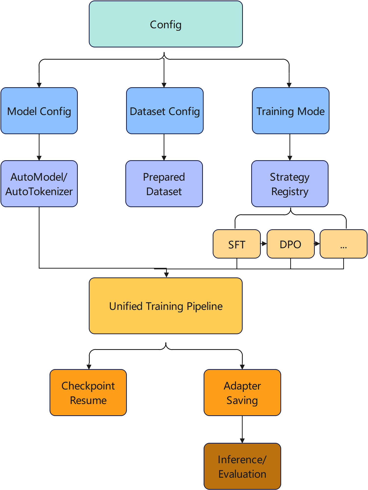
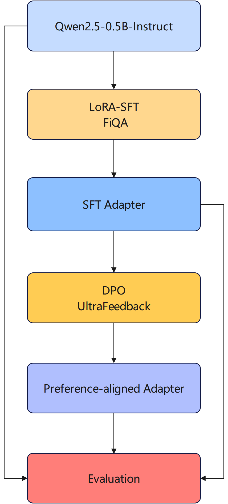

# Minimal LLM PEFT & Alignment Framework

A lightweight, config-driven framework for experimenting with **parameter-efficient fine-tuning (PEFT)** and **preference alignment** on small language models.

Built with **PyTorch**, **Hugging Face Transformers**, **PEFT**, and **TRL**.

## Features

- LoRA-based Supervised Fine-Tuning (**LoRA-SFT**)
- Direct Preference Optimization (**DPO**)
- **Base Model → SFT Adapter → DPO Alignment** continuous training
- Config-driven model, dataset, and training-mode switching
- Model Builder and Trainer Registry for modular strategy management
- Shared training arguments across trainers
- Checkpoint resume and independent Adapter saving
- Prompt-based before/after inference evaluation

> Current implemented training strategies: **SFT** and **DPO**.  
> ORPO, SimPO, PPO, and other alignment methods are planned extensions rather than current features.

---

## Architecture

The framework separates experiment configuration, model preparation, dataset preparation, training strategy selection, and the unified training lifecycle.

<p align="center">
  
</p>

The main training script focuses on orchestration. Strategy-specific model preparation and Trainer construction are handled by modular builders, allowing different experiment combinations to reuse the same training lifecycle.

---

## SFT → DPO Workflow

The current preference-alignment experiment follows a two-stage workflow:

1. perform LoRA-SFT on a supervised dataset;
2. load the trained SFT Adapter and continue optimization with DPO on preference data.

<p align="center">
  
</p>

Current example:

```text
Qwen2.5-0.5B-Instruct
        ↓
LoRA-SFT on FiQA
        ↓
SFT Adapter
        ↓
DPO on UltraFeedback
        ↓
Preference-aligned Adapter
```

The evaluation stage compares outputs from different training stages using the same prompt set.

---

## Project Structure

```text
.
├── config/
│   ├── dataset.py
│   ├── dpo.py
│   ├── model.py
│   ├── paths.py
│   ├── runtime.py
│   └── training.py
│
├── trainers/
│   ├── base.py
│   ├── sft.py
│   ├── dpo.py
│   └── __init__.py
│
├── datasets/
│   ├── eval_prompts/
│   └── raw/                 # local data, normally not committed
│
├── inference/
│   ├── chat.py
│   ├── eval_chat.py
│   ├── generate.py
│   └── loader.py
│
├── adapters/                # local training outputs
├── results/
├── utils/
├── train.py
└── README.md
```

### Config-driven experiments

Model name, dataset, training mode, paths, and training hyperparameters are managed through `config/`.

### Model preparation

`AutoModelForCausalLM` and `AutoTokenizer` provide a common loading path for supported causal language models.

Training-specific model preparation is selected through a Model Builder mapping:

- **SFT**: inject a new LoRA Adapter into the base model;
- **DPO**: load an existing SFT Adapter and continue training from that state.

### Trainer Registry

Different training strategies are implemented in separate modules and exposed through a common builder interface.

```python
TRAINER_REGISTRY = {
    "sft": build_sft_trainer,
    "dpo": build_dpo_trainer,
}
```

Shared hyperparameters are maintained in the common training-arguments layer, while strategy-specific parameters stay in the corresponding trainer module.

### Dataset handling

Model-specific tokenization is handled by Hugging Face `AutoTokenizer`.

Dataset-specific field conversion is performed during data preparation so that the training stage works with data structures appropriate for **SFT** or **preference training**, rather than depending directly on a particular raw dataset source.

---

## Experiments

| # | Model | Training | Dataset | Purpose |
|---|---|---|---|---|
| 1 | Qwen2.5-0.5B | LoRA-SFT | Dolly-15k | Base-model instruction adaptation |
| 2 | Qwen2.5-0.5B-Instruct | LoRA-SFT | FiQA | Financial-domain adaptation |
| 3 | Qwen2.5-0.5B-Instruct | LoRA-SFT | PubMedQA | Medical-domain adaptation |
| 4 | TinyLlama-1.1B-Chat | LoRA-SFT | FiQA | Cross-model domain fine-tuning |
| 5 | Qwen2.5-0.5B-Instruct | LoRA-SFT → DPO | FiQA → UltraFeedback | Preference-alignment experiment |

The evaluation uses the same prompts before and after training to inspect changes in instruction following, relevance, factual/logical correctness, and output stability.

---

## Experimental Observations

The experiments are intended both to validate the training framework and to study model behavior. They do **not** show a simple monotonic improvement after every training stage.

### 1. Instruction SFT can improve base-model stability

For **Qwen2.5-0.5B + Dolly-15k**, LoRA-SFT reduced obvious topic drift and abnormal text generation and improved basic instruction-following behavior.

### 2. Domain SFT does not guarantee general capability improvement

In the **FiQA** experiments, domain fine-tuning changed the model's response distribution but also introduced errors in some basic calculations and general questions.

This suggests that domain adaptation and general capability preservation should be evaluated separately.

### 3. Domain style is not equivalent to factual reliability

In the **PubMedQA** experiment, the fine-tuned model sometimes generated medical-style content even when required source information was missing.

A response becoming more domain-like does not necessarily make it more factual.

### 4. Preference alignment is not the same as reasoning improvement

After **FiQA SFT → UltraFeedback DPO**, some answers improved while other basic reasoning tasks became worse.

The current experiments therefore treat

```text
Preference Alignment
        ≠
Factual / Reasoning Accuracy
```

as an important evaluation distinction.

---

## Quick Start

### 1. Install dependencies

```bash
pip install torch transformers datasets peft trl
```

For reproducible experiments, pin package versions according to your Python/CUDA environment.

### 2. Prepare local models and datasets

The project currently expects local model and dataset paths configured through `config/`.

Example:

```text
models/
└── Qwen2.5-0.5B-Instruct/

datasets/
└── raw/
    ├── FiQA/
    └── UltraFeedback/
```

Large model weights and full dataset caches are intentionally not included in the Git repository.

### 3. Configure an experiment

Select the model, dataset, mode, and training hyperparameters in `config/`.

For example:

```python
MODEL_NAME = "Qwen2.5-0.5B-Instruct"
MODE = "sft"
```

### 4. Train

```bash
python train.py
```

If the output directory contains a valid previous checkpoint, training can resume from the latest checkpoint.

---

## Current Limitations

- Experiments currently focus on small language models.
- Evaluation is mainly based on a fixed prompt set rather than a complete automated benchmark suite.
- Dataset schema validation is not yet fully implemented.
- LoRA hyperparameters and data scale have not yet been systematically ablated.
- Only SFT and DPO are currently implemented.

---

## Roadmap

- [ ] Standardized SFT / Preference dataset schema validation
- [ ] Unified automated evaluation pipeline
- [ ] Quantitative reasoning and factuality evaluation
- [ ] Preference pairwise evaluation / win rate
- [ ] LoRA hyperparameter ablation
- [ ] ORPO
- [ ] SimPO
- [ ] Further exploration of PPO-style alignment
- [ ] Improved experiment tracking and component registration

---

## Repository Notes

To keep the repository lightweight, large local artifacts such as base-model weights, dataset caches, and training checkpoints should remain excluded from Git.

Recommended to keep in the repository:

```text
source code
configs
evaluation prompts
small JSON evaluation results
architecture diagrams
documentation
```

Recommended to exclude:

```text
models/
datasets/raw/
checkpoint-*/
*.safetensors
*.arrow
```

---

## About

This project is a personal exploration of:

- parameter-efficient LLM fine-tuning;
- preference alignment;
- modular training-framework design;
- model behavior evaluation;
- the relationship between model, data, optimization objective, and reliability.

A key observation from the current experiments is that post-training should not simply be interpreted as making a model "better". Different models, datasets, objectives, and evaluation dimensions can produce different capability trade-offs.
